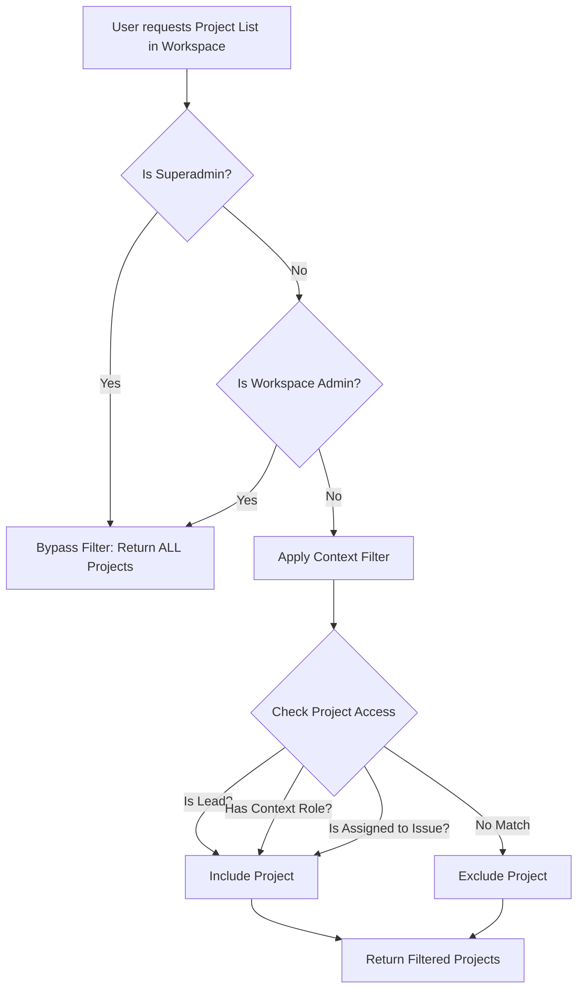

# Functional Specification Document (FSD)
## Context-Aware RBAC for Workspace & Projects

### 1. Deskripsi Fitur
Fitur Context-Aware RBAC adalah mekanisme keamanan berlapis yang memastikan pengguna hanya dapat mengakses Workspace dan Project yang relevan dengan peran mereka. Sistem membedakan hak akses tingkat global (Superadmin), tingkat Workspace, dan tingkat Project.

### 2. Alur Kerja (Workflow)

### 3. Struktur Data
- `workspaces`: Container utama (tenant).
- `workspace_members`: Menentukan anggota yang masuk ke suatu Workspace.
- `user_roles`: Menyimpan assignment role spesifik (dengan `context_type` = 'PROJECT' dan `context_id`).

### 4. Batasan Keamanan (Anti-IDOR)
- Pengguna yang tidak terdaftar di `workspace_members` dilarang mengakses segala endpoint di Workspace tersebut.
- Pengguna reguler hanya menerima JSON array dari Project yang diizinkan untuk mereka lihat (Zero Data Breach).
