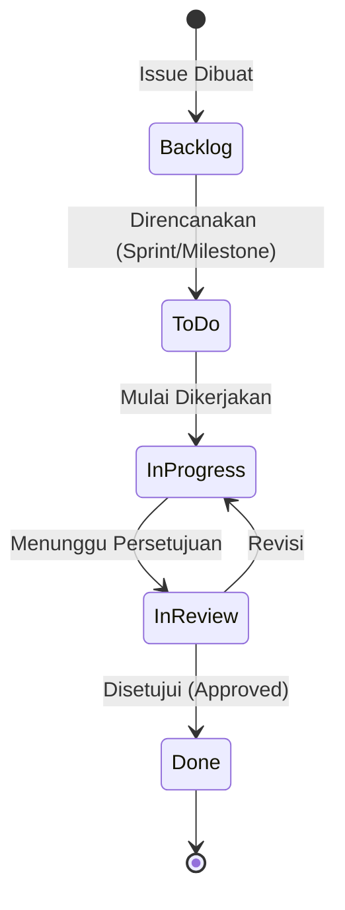
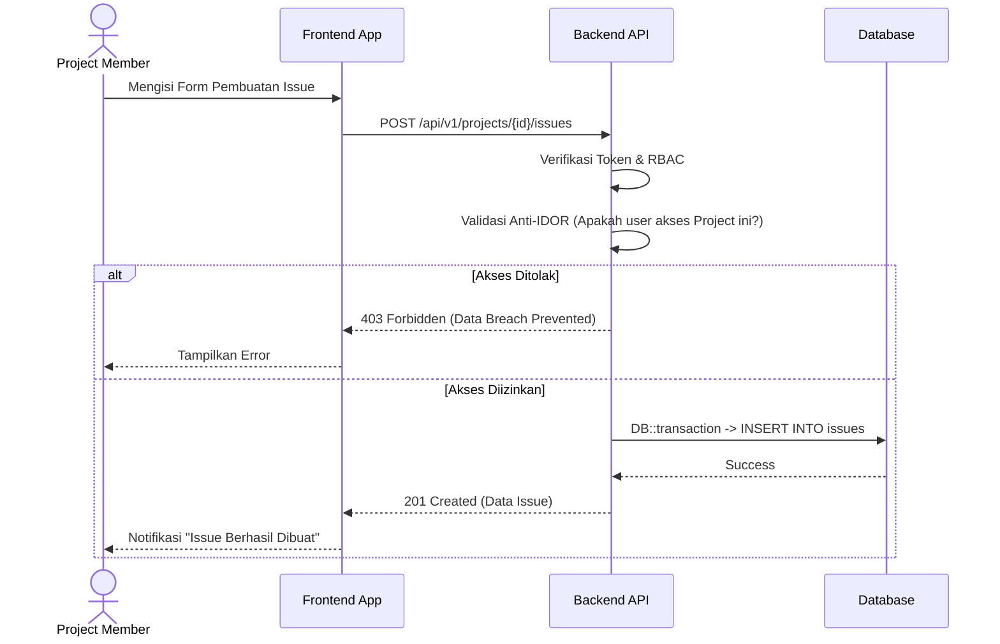

# FUNCTIONAL SPECIFICATION DOCUMENT (FSD)

**Modul:** Issues / Ticketing Management
**Proyek:** Workload Management System (WLMS)
**Tanggal Dokumen:** 17 September 2026
**Versi:** 1.0.0
**Klasifikasi:** Rahasia / Internal (Confidential)

## 1. INFORMASI KONTROL DOKUMEN

| Versi | Tanggal | Penulis | Deskripsi Perubahan | Disetujui Oleh |
| --- | --- | --- | --- | --- |
| 1.0.0 | 17-Sep-2026 | Technical Writer | Inisiasi FSD Modul Issues/Ticketing | VP Engineering |

## 2. PENDAHULUAN
### 2.1 Latar Belakang
Modul Issues / Ticketing Management merupakan komponen esensial dalam tata kelola operasional dan pengembangan perangkat lunak (SDLC). Modul ini bertujuan untuk mencatat, melacak, dan menyelesaikan setiap kendala, *bug*, atau penugasan (tugas/isu) yang terkait dengan suatu *Project* atau *Workspace*.

### 2.2 Tujuan
Menyediakan landasan spesifikasi fungsional untuk memastikan bahwa pengembangan dan implementasi fitur pelacakan isu berjalan selaras dengan kebijakan tata kelola TI (*IT Governance*), termasuk kontrol akses keamanan berlapis (RBAC).

## 3. ATURAN BISNIS (BUSINESS RULES)

### 3.1 Relasi Entitas Utama
- **Project to Issues:** Satu *Project* dapat memiliki banyak *Issues* (1:N). *Issue* tidak dapat berdiri sendiri tanpa *Project*.
- **User to Issues (Reporter):** Satu *User* dapat melaporkan banyak *Issues* (1:N).
- **User to Issues (Assignee):** Satu *Issue* dapat ditugaskan ke satu atau beberapa *User* yang tergabung dalam *Project* terkait (N:M).
- **Status Lifecycle:** Setiap *Issue* memiliki *Status* yang terikat pada *Workflow* tertentu (contoh: *Backlog* -> *To Do* -> *In Progress* -> *In Review* -> *Done*).

### 3.2 Otorisasi & Validasi (Keamanan)
- **BR-ISS-01:** Hanya pengguna dengan *Role* minimal `Project Member` pada *Project* tersebut yang berhak membuat *Issue*.
- **BR-ISS-02 (Anti-IDOR):** Pengguna **dilarang keras** mengubah atau melihat *Issue* di *Project* yang bukan merupakan wewenangnya. Validasi harus diimplementasikan di level infrastruktur (Backend / API).
- **BR-ISS-03:** *Status* hanya dapat diubah oleh *Assignee*, *Project Manager*, atau peran dengan hak akses lebih tinggi (*Manager/VP/Director*).

### 3.3 Aturan Bisnis Komentar (Issue Comments)
- **BR-ISS-04:** Setiap *Issue* dapat memiliki banyak komentar (1:N).
- **BR-ISS-05:** Pengguna hanya dapat menambahkan komentar pada *Issue* yang ada di dalam *Project* yang berhak diaksesnya.
- **BR-ISS-06:** Komentar tidak dapat diubah (immutable) setelah dikirim, demi menjaga rekam jejak audit (audit trail).
- **BR-ISS-07:** *User* akan menerima notifikasi jika ada komentar baru pada *Issue* yang ditugaskan kepadanya atau yang dilaporkannya.

## 4. DIAGRAM ALUR (MERMAID DIAGRAM)

### 4.1 State Diagram: Siklus Hidup Issue (Issue Lifecycle)

### 4.2 Sequence Diagram: Pembuatan Issue

## 5. KEBUTUHAN ANTARMUKA
Antarmuka pengguna harus mengadopsi standar *Clean UI* dan memisahkan *server state* (via React Query) untuk mencegah *stale data* pada Kanban Board. Komponen form harus membaca *maxLength* dari spesifikasi API.

## 6. PERSETUJUAN
Dokumen ini dianggap sah setelah ditandatangani oleh pemangku kepentingan.

*(Tanda Tangan Elektronik / Approval Workflow Terlampir)*

## 4. Sprint Planning & Backlog
- **Drag & Drop**: Menggunakan dnd-kit.
- **Sprint Lifecycle**: PENDING -> ACTIVE -> COMPLETED.
- **Anti-Overlap**: Hanya boleh 1 sprint ACTIVE per project.