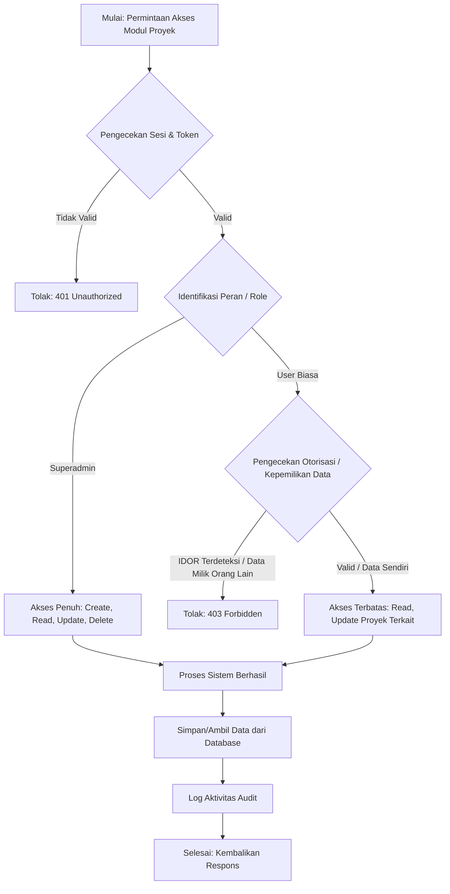
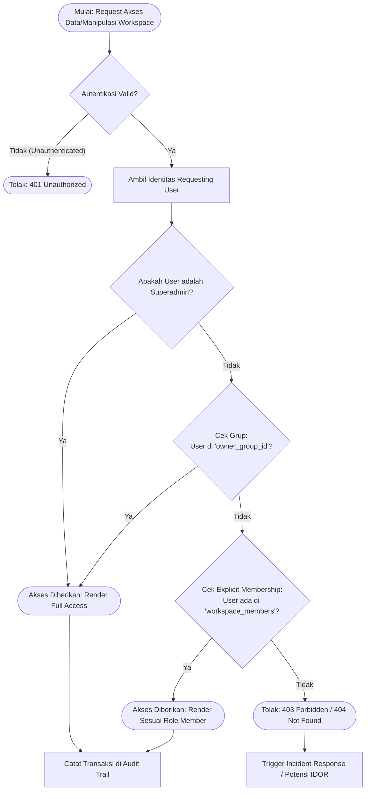
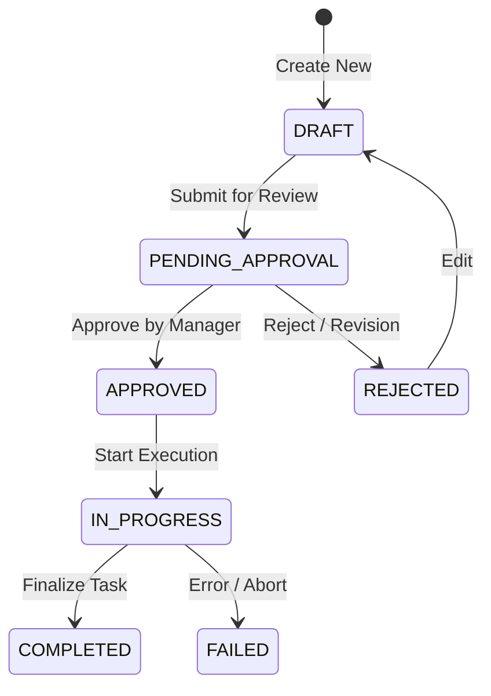
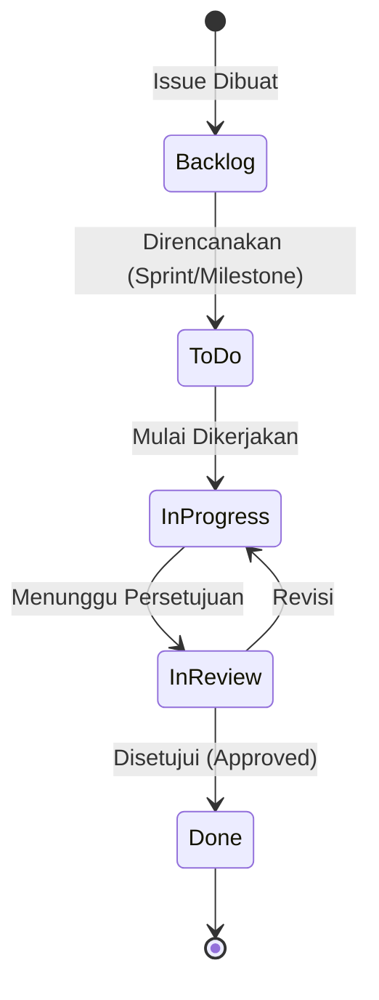
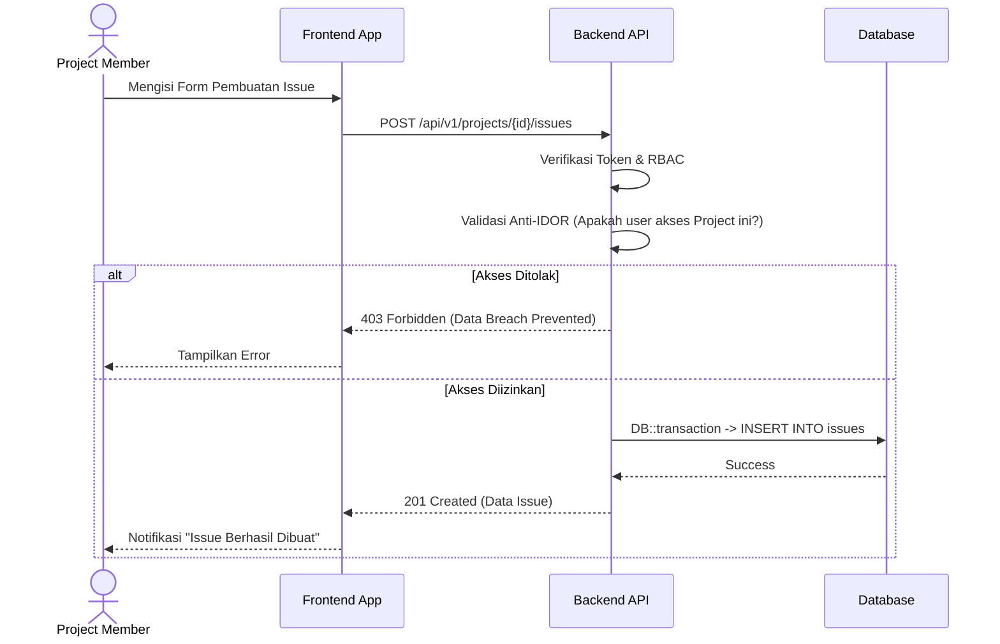
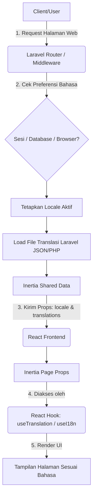
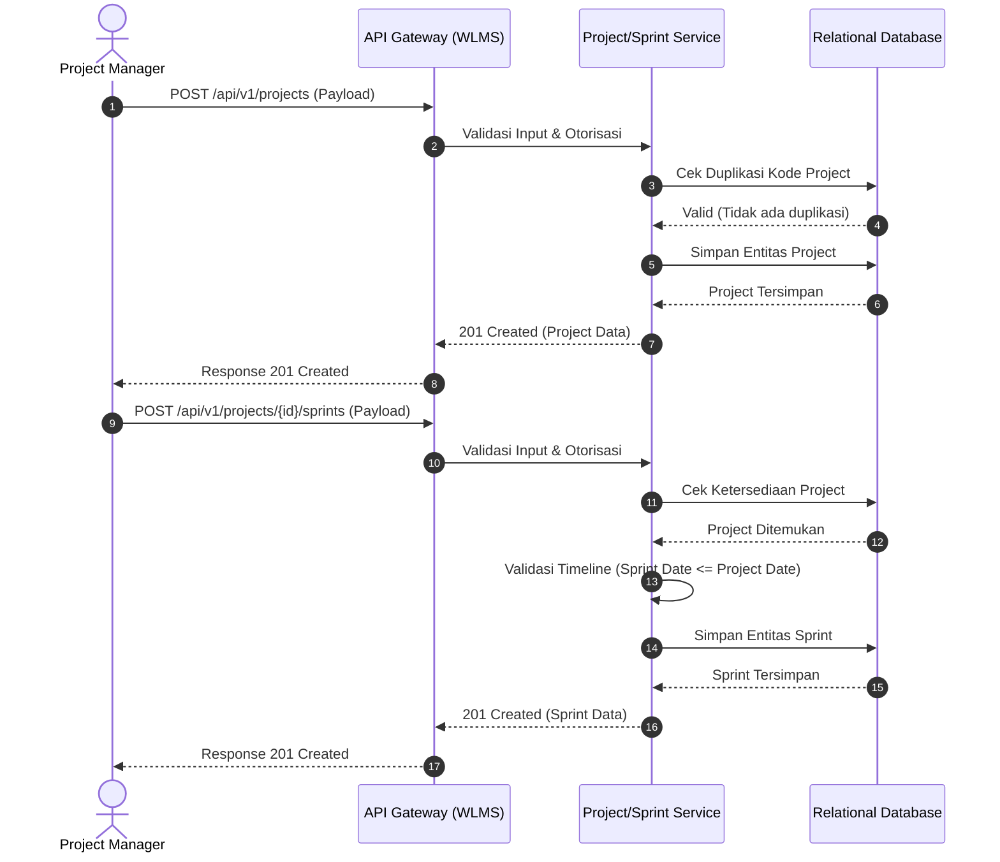
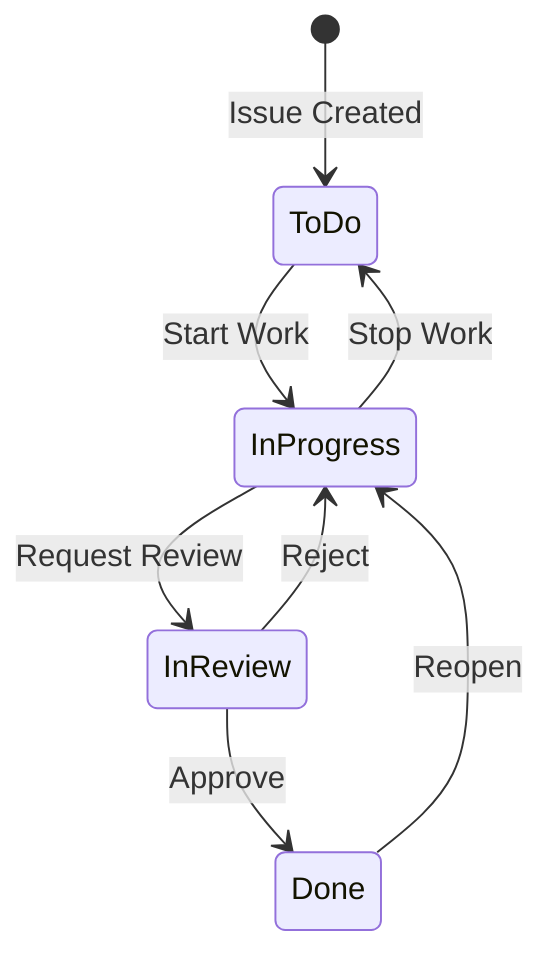

# FSD - WLMS Project

Dokumen ini adalah gabungan dari semua dokumentasi terkait dalam proyek.

---

## Project Management

### FUNCTIONAL SPECIFICATION DOCUMENT (FSD)

**Modul:** Project Management (Manajemen Proyek)  
**Tanggal:** 17 September 2026  
**Status:** Approved (Lulus Audit QA & Security)  

#### 1. Pendahuluan
Dokumen ini menguraikan spesifikasi fungsional untuk modul Manajemen Proyek (Project Management). Fitur ini mencakup proses pembuatan, pembacaan, pembaruan, dan pengarsipan/penghapusan (CRUD) data proyek di dalam sistem, serta pembatasan akses berbasis peran (Role-Based Access Control - RBAC).

#### 2. Tujuan
Menyediakan panduan komprehensif bagi pengembang, penguji, dan auditor IT Compliance mengenai fungsionalitas dan otorisasi dari modul Manajemen Proyek.

#### 3. Ruang Lingkup
Fitur Manajemen Proyek mencakup operasi berikut:
1. **Create Project**: Pengguna dengan hak akses yang sesuai dapat membuat proyek baru.
2. **Read Project**: Pengguna dapat melihat detail proyek yang diotorisasi untuk mereka.
3. **Update Project**: Pengguna dengan hak akses yang sesuai dapat memperbarui informasi proyek.
4. **Archive/Delete Project**: Pengguna dengan hak akses (Superadmin) dapat mengarsipkan atau menghapus proyek.

#### 4. Otorisasi dan Keamanan (RBAC)
Akses menuju fungsi Manajemen Proyek diatur berdasarkan *Role-Based Access Control* (RBAC):
- **Superadmin**: Memiliki akses penuh terhadap seluruh operasi (Create, Read, Update, Delete/Archive) pada seluruh proyek.
- **User Biasa (Manager/Staff)**: Hanya dapat melihat dan memperbarui proyek yang ditugaskan kepada mereka. Tidak diperkenankan melakukan manipulasi data di luar otorisasi yang diberikan (Anti-IDOR terimplementasi).

#### 5. Alur Sistem (Flowchart)
Berikut adalah alur pembuatan proyek dan pengecekan otorisasi RBAC:



#### 6. Persyaratan Kepatuhan (Compliance)
Seluruh aktivitas dalam modul ini dicatat dalam log audit, meliputi ID pengguna, waktu akses, alamat IP, dan jenis operasi untuk mematuhi regulasi perbankan/BUMN terkait perlindungan data.

---

## Workspace Members

### FUNCTIONAL SPECIFICATION DOCUMENT (FSD) & ARCHITECTURE

**Modul:** Workspace Members & Security Visibility
**Fase:** 6 (Technical Writer)
**Tanggal:** 18 September 2026
**Status:** Approved (Lulus Audit QA & Security)

#### 1. Pendahuluan
Dokumen ini menguraikan spesifikasi fungsional dan arsitektur keamanan untuk fitur **Workspace Members**. Fitur ini dirancang secara spesifik untuk mengatur struktur keanggotaan kolaboratif di dalam sebuah Workspace dan memastikan tercapainya isolasi data antar pengguna yang aman (multi-tenancy abstraction), melalui implementasi sistem keamanan **Anti-IDOR (Insecure Direct Object Reference)**.

#### 2. Struktur Database
Relasi pengguna (User) dengan ruang kerja (Workspace) dikelola melalui *Pivot Table* (Many-to-Many relationship) dengan penambahan metadata penugasan.

### Skema Tabel `workspace_members`
Tabel ini merepresentasikan keanggotaan eksplisit pengguna ke sebuah Workspace.

- `id` (Big Integer / Primary Key)
- `workspace_id` (UUID, Foreign Key ke tabel `workspaces`, On Delete Cascade)
- `user_id` (Big Integer, Foreign Key ke tabel `users`, On Delete Cascade)
- `role` (String, Default: `viewer`) - *Mendefinisikan hak akses internal: `viewer`, `member`, `admin`.*
- `created_at` (Timestamp)
- `updated_at` (Timestamp)

Tabel ini mengimplementasikan `UNIQUE(workspace_id, user_id)` constraint pada tingkat database guna memastikan tidak terjadinya duplikasi keanggotaan dalam satu workspace.

#### 3. Arsitektur Security (Anti-IDOR)
Guna mencegah kebocoran data (*Data Leakage*) secara vertikal maupun horizontal (IDOR vulnerability), sistem mengadopsi skema perizinan ganda (Dual-Ownership Validation) dalam merender data dan mengotorisasi tindakan di ruang kerja.

Kondisi otorisasi visibilitas (*Workspace Visibility*) dikendalikan sebagai berikut:

Sebuah Workspace berstatus **DAPAT DIAKSES** oleh entitas User Requesting bilamana:
1. **Kepemilikan Grup (Group Ownership Validation)**
   User terdaftar dalam Organisasi/Grup yang menjadi pemilik struktural Workspace tersebut (melalui parameter `owner_group_id` di entitas `workspaces`).
   **ATAU**
2. **Delegasi Eksplisit (Explicit Membership Validation)**
   User secara sah terdaftar sebagai anggota di tabel `workspace_members` dengan `workspace_id` yang terasosiasi.

Bilamana kedua syarat di atas tidak terpenuhi, sistem dirancang *fail-secure* dengan secara proaktif menolak akses menggunakan respon protokol `HTTP 403 Forbidden` atau `HTTP 404 Not Found` (untuk menyamarkan eksistensi data dari attacker).

#### 4. API Endpoints
Berikut adalah spesifikasi integrasi *Endpoint API* Workspace Members (telah lolos tes integrasi Pest PHP):

- **GET `/api/workspaces/{workspace_id}/members`**
  - **Fungsi:** Mengembalikan daftar anggota yang berada di dalam Workspace.
  - **Pengamanan Akses:** Sistem memastikan user pemanggil (caller) memiliki visibilitas terhadap workspace tersebut.

- **POST `/api/workspaces/{workspace_id}/members`**
  - **Fungsi:** Menambahkan atau mengundang anggota baru ke Workspace (dengan role: `admin`, `member`, atau `viewer`).
  - **Pengamanan Akses:** Dibatasi (RBAC), mengharuskan user pemanggil memiliki autorisasi *Update Workspace* (Workspace Admin atau bagian dari Owner Group).

- **DELETE `/api/workspaces/{workspace_id}/members/{user_id}`**
  - **Fungsi:** Mencabut akses pengguna dari ruang kerja.
  - **Pengamanan Akses:** Mengharuskan autorisasi *Update Workspace*.

*Catatan QA: Segala percobaan Bypass-IDOR pada operasi manipulasi (POST/DELETE) antar anggota terisolasi dipastikan ditolak (Status 403).*

#### 5. Hierarki Keamanan: Alir Visibilitas Workspace
Representasi diagram alir berikut menggambarkan tata kelola bagaimana Backend/Core merender dan mengevaluasi otorisasi visibilitas Workspace untuk Requesting User.



#### 6. Integrasi Log Audit (Compliance)
Setiap modifikasi data (Penambahan, Pencabutan akses, Perubahan Role) maupun deteksi percobaan eksploitasi visibilitas Anti-IDOR wajib didokumentasikan di dalam **Global Audit Trail** guna memenuhi prasyarat investigasi *Security Forensics* serta mendukung parameter penilaian kepatuhan (*IT Governance/Compliance*).

---

## Workflow State

### FUNCTIONAL SPECIFICATION DOCUMENT (FSD)
#### MODUL WORKFLOW & STATE MACHINE (STATUSES & WORKFLOWS)

**Informasi Dokumen**
| Atribut | Keterangan |
|---------|------------|
| **Nama Proyek** | WLMS (Warehouse Logistics Management System) |
| **Modul** | Workflow & State Machine |
| **Versi** | 1.0.0 |
| **Tanggal** | 17 September 2026 |
| **Status** | Final |
| **Penulis** | Technical Writer |

---

### 1. PENDAHULUAN
#### 1.1 Tujuan
Dokumen ini bertujuan untuk mendefinisikan spesifikasi fungsional dari Modul Workflow & State Machine pada sistem WLMS. Modul ini bertanggung jawab atas pengelolaan status (states) dan alur kerja (workflows) untuk berbagai entitas dalam sistem, memastikan integritas data dan keamanan operasional (Enterprise-Grade).

#### 1.2 Ruang Lingkup
Ruang lingkup mencakup:
- Manajemen Data Status (Pembuatan, Pembaruan, Penghapusan, dan Pembacaan Status).
- Manajemen Data Workflow (Pembuatan, Pembaruan, Penghapusan, dan Pembacaan Workflow yang menghubungkan status asal dan status tujuan).
- Integrasi aturan transisi antar status (State Machine) untuk entitas bisnis.

### 2. DESKRIPSI FUNGSIONAL
Sistem harus mampu memfasilitasi Superadmin dalam mengatur konfigurasi status yang dinamis, serta mendefinisikan transisi antar status secara rigid melalui workflow. Setiap perubahan status entitas bisnis dalam aplikasi akan divalidasi oleh State Machine, untuk mencegah loncatan proses yang tidak semestinya, manipulasi paramter (IDOR), dan inkonsistensi data.

### 3. ALUR PROSES (BUSINESS PROCESS)

#### 3.1 Diagram Alur Pengelolaan Status & Workflow
Berikut adalah diagram alur yang menggambarkan bagaimana sistem memvalidasi dan memproses transisi status sesuai desain security-first:

```mermaid
flowchart TD
    A[Start: Permintaan Perubahan Status Entitas] --> B{Validasi Autentikasi\n& Akses Sistem}
    B -- Ditolak --> C[Error 401/403: Akses Ditolak]
    B -- Lolos --> D{Cek Status Asal\ndan Status Tujuan}
    D --> E{Validasi State Machine\n(Apakah ada Workflow valid?)}
    E -- Tidak Valid --> F[Error 422: Transisi Tidak Diizinkan / Invalid State]
    E -- Valid --> G{Cek Role/Akses Transisi\n(Anti-IDOR / Privilege Check)}
    G -- Tidak Punya Akses --> H[Error 403: Role Tidak Diizinkan]
    G -- Punya Akses --> I[Terapkan Perubahan Status]
    I --> J[Catat ke Audit Trail / Log Transisi]
    J --> K[End: Transisi Berhasil]
    C --> K
    F --> K
    H --> K
```

#### 3.2 Diagram State Machine (Contoh Siklus Dokumen/Pesanan)


### 4. ATURAN BISNIS (BUSINESS RULES)
1. **Integritas Referensial (Anti-Soft-Delete Leak)**: Status yang telah direferensikan/digunakan oleh suatu entitas aktif tidak dapat dihapus (Restrict/Soft Delete mechanism).
2. **Validasi Transisi (State Machine Constraints)**: Pembaruan status (contoh dari `DRAFT` menjadi `COMPLETED`) tidak dapat dilakukan jika di dalam konfigurasi Workflow tidak terdapat rute yang menghubungkannya.
3. **Idempotensi**: Permintaan transisi yang sama berulang kali tidak boleh mengubah state secara inkonsisten (contoh: Mengirim status `APPROVED` ke dokumen yang sudah berstatus `APPROVED` akan diabaikan atau direject dengan pesan sesuai).
4. **Isolasi Data (Tenant-Isolation)**: Jika sistem beroperasi secara multi-tenant, Status dan Workflow milik Organisasi A tidak bisa dilihat apalagi diubah oleh Organisasi B.

### 5. MANAJEMEN HAK AKSES (ROLE & PERMISSION)
- **Superadmin**: Memiliki hak akses penuh (CRUD) terhadap konfigurasi dasar Status dan Workflow sistem.
- **Admin Instansi/Cabang**: Hanya dapat mengatur transisi spesifik yang berlaku pada organisasinya saja (terikat pada Tenant ID).
- **Staff/End-User**: Hanya memiliki hak eksekusi pergantian status sesuai dengan tugasnya, dan tidak memiliki akses modifikasi struktur state machine.

### 6. KRITERIA PENERIMAAN (ACCEPTANCE CRITERIA)
- Sistem dapat menyimpan dan menampilkan log dari setiap perpindahan status yang berhasil.
- Upaya melompati proses (bypass status) oleh user dengan modifikasi parameter API akan menghasilkan HTTP response `422` atau `403`.
- Upaya manipulasi ID yang bukan milik organisasinya (IDOR Attack) akan digagalkan dengan respons standar tanpa membocorkan eksistensi data (`404` atau `403`).

---

## Issues Management

### FUNCTIONAL SPECIFICATION DOCUMENT (FSD)

**Modul:** Issues / Ticketing Management
**Proyek:** Workload Management System (WLMS)
**Tanggal Dokumen:** 17 September 2026
**Versi:** 1.0.0
**Klasifikasi:** Rahasia / Internal (Confidential)

#### 1. INFORMASI KONTROL DOKUMEN

| Versi | Tanggal | Penulis | Deskripsi Perubahan | Disetujui Oleh |
| --- | --- | --- | --- | --- |
| 1.0.0 | 17-Sep-2026 | Technical Writer | Inisiasi FSD Modul Issues/Ticketing | VP Engineering |

#### 2. PENDAHULUAN
### 2.1 Latar Belakang
Modul Issues / Ticketing Management merupakan komponen esensial dalam tata kelola operasional dan pengembangan perangkat lunak (SDLC). Modul ini bertujuan untuk mencatat, melacak, dan menyelesaikan setiap kendala, *bug*, atau penugasan (tugas/isu) yang terkait dengan suatu *Project* atau *Workspace*.

### 2.2 Tujuan
Menyediakan landasan spesifikasi fungsional untuk memastikan bahwa pengembangan dan implementasi fitur pelacakan isu berjalan selaras dengan kebijakan tata kelola TI (*IT Governance*), termasuk kontrol akses keamanan berlapis (RBAC).

#### 3. ATURAN BISNIS (BUSINESS RULES)

### 3.1 Relasi Entitas Utama
- **Project to Issues:** Satu *Project* dapat memiliki banyak *Issues* (1:N). *Issue* tidak dapat berdiri sendiri tanpa *Project*.
- **User to Issues (Reporter):** Satu *User* dapat melaporkan banyak *Issues* (1:N).
- **User to Issues (Assignee):** Satu *Issue* dapat ditugaskan ke satu atau beberapa *User* yang tergabung dalam *Project* terkait (N:M).
- **Status Lifecycle:** Setiap *Issue* memiliki *Status* yang terikat pada *Workflow* tertentu (contoh: *Backlog* -> *To Do* -> *In Progress* -> *In Review* -> *Done*).

### 3.2 Otorisasi & Validasi (Keamanan)
- **BR-ISS-01:** Hanya pengguna dengan *Role* minimal `Project Member` pada *Project* tersebut yang berhak membuat *Issue*.
- **BR-ISS-02 (Anti-IDOR):** Pengguna **dilarang keras** mengubah atau melihat *Issue* di *Project* yang bukan merupakan wewenangnya. Validasi harus diimplementasikan di level infrastruktur (Backend / API).
- **BR-ISS-03:** *Status* hanya dapat diubah oleh *Assignee*, *Project Manager*, atau peran dengan hak akses lebih tinggi (*Manager/VP/Director*).

### 3.3 Aturan Bisnis Komentar (Issue Comments)
- **BR-ISS-04:** Setiap *Issue* dapat memiliki banyak komentar (1:N).
- **BR-ISS-05:** Pengguna hanya dapat menambahkan komentar pada *Issue* yang ada di dalam *Project* yang berhak diaksesnya.
- **BR-ISS-06:** Komentar tidak dapat diubah (immutable) setelah dikirim, demi menjaga rekam jejak audit (audit trail).
- **BR-ISS-07:** *User* akan menerima notifikasi jika ada komentar baru pada *Issue* yang ditugaskan kepadanya atau yang dilaporkannya.

#### 4. DIAGRAM ALUR (MERMAID DIAGRAM)

### 4.1 State Diagram: Siklus Hidup Issue (Issue Lifecycle)


### 4.2 Sequence Diagram: Pembuatan Issue


#### 5. KEBUTUHAN ANTARMUKA
Antarmuka pengguna harus mengadopsi standar *Clean UI* dan memisahkan *server state* (via React Query) untuk mencegah *stale data* pada Kanban Board. Komponen form harus membaca *maxLength* dari spesifikasi API.

#### 6. PERSETUJUAN
Dokumen ini dianggap sah setelah ditandatangani oleh pemangku kepentingan.

*(Tanda Tangan Elektronik / Approval Workflow Terlampir)*


#### 4. Sprint Planning & Backlog
- **Drag & Drop**: Menggunakan dnd-kit.
- **Sprint Lifecycle**: PENDING -> ACTIVE -> COMPLETED.
- **Anti-Overlap**: Hanya boleh 1 sprint ACTIVE per project.

---

## Notifications

### Functional Specification Document: In-App Notifications

#### 1. Overview
Fitur notifikasi in-app memungkinkan pengguna (Workspace Members) untuk menerima pembaruan secara real-time terkait aktivitas dalam Workspace mereka tanpa perlu melakukan refresh halaman.

#### 2. Fitur Utama
1. **Real-time Push**: Menggunakan Laravel Reverb (WebSocket) untuk mendorong event notifikasi ke pengguna secara spesifik (private channel).
2. **Notification Bell UI**: Komponen ikon lonceng pada navbar (sudut kanan atas) dengan indikator angka untuk notifikasi yang belum dibaca.
3. **Notification List**: Popover dropdown yang menampilkan daftar riwayat notifikasi beserta ikon khusus berdasarkan jenis event dan waktu relatif (misal: "2 mins ago").
4. **Mark as Read**: Pengguna dapat menandai semua notifikasi sebagai telah dibaca. Saat popover dibuka dan terdapat notifikasi yang belum dibaca, sistem akan secara otomatis menandai semuanya sebagai "read".

#### 3. Triggers / Events
Sistem akan memicu notifikasi ketika:
- `issue.assigned`: Saat sebuah issue di-assign ke pengguna (kecuali jika meng-assign diri sendiri).
- `comment.added`: Saat sebuah komentar ditambahkan ke issue (notifikasi dikirim ke reporter & assignee issue).
- `issue.transitioned`: Saat status issue diubah (notifikasi dikirim ke reporter & assignee).
- `sprint.state_changed`: Saat Sprint dimulai (ACTIVE) atau diselesaikan (COMPLETED), notifikasi dikirim ke seluruh member workspace.

#### 4. Arsitektur Teknis
- **Backend**: Laravel 11/12 dengan Modular Architecture (Modul `Notification`).
- **Database**: Tabel `notifications` dengan UUID, dan JSON data payload.
- **WebSocket**: Laravel Reverb.
- **Frontend**: React (Inertia.js), Laravel Echo, Pusher-JS, React Query (TanStack Query), Shadcn UI, Sonner (untuk Toasts).

#### 5. Keamanan (Anti-IDOR)
Endpoint API untuk mengambil atau memperbarui notifikasi hanya membaca dari `auth()->id()`. Pengguna tidak dapat membaca notifikasi milik pengguna lain. Saluran WebSocket dikunci menggunakan Laravel Sanctum guard pada channel `private-user.{userId}`.

---

## Multi Language

### Functional Specification Document (FSD)
#### Fitur: Multi-Language (i18n)

### 1. Deskripsi Fitur
Fitur Multi-Language (i18n) memungkinkan aplikasi Web LMS (WLMS) untuk diakses dalam berbagai bahasa (misalnya, Bahasa Indonesia dan Bahasa Inggris). Fitur ini diimplementasikan menggunakan Laravel di sisi backend untuk mengelola file translasi, Inertia.js sebagai jembatan pengiriman data, dan React di sisi frontend untuk me-render teks yang diterjemahkan menggunakan kustom React Hook.

Tujuan utama fitur ini adalah meningkatkan aksesibilitas dan user experience (UX) bagi pengguna dengan preferensi bahasa yang berbeda.

### 2. Arsitektur & Alir Data (Flowchart)
Berikut adalah diagram alir yang menggambarkan proses bagaimana bahasa dimuat dari Backend ke Frontend:



### 3. Komponen Utama
- **Backend (Laravel)**: Menyediakan middleware untuk mendeteksi dan menyimpan locale pengguna, serta memanfaatkan mekanisme Share Data dari Inertia untuk mengirim array/objek translasi ke client.
- **Bridge (Inertia.js)**: Menyisipkan data `translations` dan `current_locale` ke dalam setiap response halaman.
- **Frontend (React)**: Menggunakan Hook kustom (misal `useTranslation()`) yang membaca teks berdasar *key* yang diminta dan mencocokkannya dari props Inertia secara reaktif.

---

## Phase 6 Project Sprint

### Functional Specification Document (FSD)
#### Modul Manajemen Proyek dan Sprint (Phase 6)

**Versi Dokumen:** 1.0.0
**Status:** Final / APPROVED
**Klasifikasi:** Internal Terbatas

### 1. Latar Belakang dan Tujuan Bisnis
Workload Management System (WLMS) memerlukan modul fundamental untuk mengelola siklus hidup inisiatif bisnis melalui entitas **Project** dan iterasi kerja melalui entitas **Sprint**. Modul ini memfasilitasi _Project Manager_ dan _Scrum Master_ dalam merencanakan alokasi sumber daya dan menargetkan batas waktu (timeline) secara presisi.

### 2. Ruang Lingkup (Scope)
Spesifikasi ini mencakup fungsionalitas:
1. Registrasi dan pengaturan _Project_ baru.
2. Pembuatan dan penjadwalan _Sprint_ di dalam batasan waktu _Project_.
3. Validasi aturan bisnis terkait status dan linimasa waktu.

### 3. Alur Proses Bisnis (Business Process Flow)
Berikut adalah alur sistem pada saat penciptaan Project dan Sprint.



### 4. Spesifikasi Entitas dan Validasi
#### 4.1 Entitas Project
| Atribut | Tipe Data | Mandatory | Aturan Validasi / Keterangan |
| :--- | :--- | :---: | :--- |
| `ProjectCode` | String | Y | Maks 10 karakter, Alfanumerik kapital, Unik. |
| `ProjectName` | String | Y | Maks 100 karakter. |
| `StartDate` | Date | Y | Tidak boleh kurang dari tanggal server (hari ini). |
| `EndDate` | Date | Y | Harus lebih besar atau sama dengan `StartDate`. |
| `Status` | Enum | Y | _Default_: `PLANNED`. Limitasi state: `PLANNED`, `ACTIVE`, `COMPLETED`, `ON_HOLD`. |

#### 4.2 Entitas Sprint
| Atribut | Tipe Data | Mandatory | Aturan Validasi / Keterangan |
| :--- | :--- | :---: | :--- |
| `ProjectId` | UUID | Y | Harus merujuk pada Project yang eksis dan tidak berstatus `COMPLETED`. |
| `SprintName` | String | Y | Maks 50 karakter (Contoh: "Sprint 1 - Onboarding"). |
| `StartDate` | Date | Y | Harus berada dalam rentang waktu `StartDate` dan `EndDate` Project terkait. |
| `EndDate` | Date | Y | Harus lebih besar dari `StartDate` Sprint, dan tetap dalam rentang Project. |
| `Status` | Enum | Y | _Default_: `DRAFT`. Limitasi state: `DRAFT`, `ACTIVE`, `CLOSED`. |

### 5. Aturan Bisnis (Business Rules)
1. **Time-boxing Constraint:** Sistem harus menolak pembuatan _Sprint_ apabila `StartDate` atau `EndDate` berada di luar linimasa _Project_ induk. Fungsionalitas ini mencegah kebocoran anggaran dan waktu.
2. **State Dependency:** _Sprint_ tidak dapat diubah menjadi `ACTIVE` jika _Project_ masih dalam state `PLANNED` atau `ON_HOLD`.
3. **Immutability Limits:** `ProjectCode` bersifat _immutable_ setelah sistem merespons sukses (201 Created).

---

## Phase 7 Issues

### Functional Specification Document (FSD)
#### Module: Issues/Tasks Management (Sprint 7)

### 1. Pendahuluan
Dokumen ini menguraikan spesifikasi fungsional dan teknis untuk modul manajemen isu dan tugas (Sprint 7) pada Workload Management System (WLMS). Modul ini menggunakan Clean Architecture pada backend dan pendekatan Optimistic UI pada antarmuka pengguna.

### 2. Arsitektur Backend
Sistem menggunakan pendekatan Modular Monolith.
- **Entity**: `Issue` (Aggregate Root) bertanggung jawab atas konsistensi data tugas.
- **Value Objects (VO)**: 
  - `IssueKey` (Auto-numbering project, misal: PROJ-123).
  - `IssueStatus` (Status dari isu).
- **Domain Services**:
  - `WorkflowEngine`: State Machine yang memvalidasi transisi status isu. Mesin ini memastikan bahwa sebuah isu hanya bisa berpindah dari status A ke B apabila didefinisikan dalam aturan _Workflow_.

#### State Machine Workflow Diagram


### 3. Arsitektur Antarmuka Pengguna (UI)
Antarmuka manajemen tugas dibangun sebagai Kanban Board menggunakan pustaka `dnd-kit`.
- **Drag-and-Drop**: Pengguna dapat memindahkan tiket antar kolom status.
- **Optimistic UI / Rollback**: Saat pengguna menjatuhkan (drop) kartu pada kolom baru, UI akan langsung diperbarui seolah-olah berhasil. Apabila API mengembalikan error (contoh: validasi `WorkflowEngine` gagal), UI akan secara otomatis melakukan _rollback_ mengembalikan kartu ke kolom asalnya tanpa _page reload_.

---

## Phase 8 Collaboration

### Functional Specification Document (FSD)
#### Modul Collaboration (Global Audit Trail & Comments)

### 1. Tujuan
Memastikan tersedianya fitur *black-box* Audit Trail untuk mencatat semua perubahan di dalam WLMS, memenuhi standar compliance BUMN, serta menyediakan fitur komentar threaded (diskusi) pada Issue.

### 2. Fitur Utama
1. **Global Audit Trail:** Mencatat aksi `created`, `transitioned`, `assigned`, dll. secara asinkron dari *domain event*. Table bersifat *append-only*.
2. **Issue Comments:** Menambahkan, mengedit, dan memuat komentar terkait suatu tiket/issue dengan dukungan nested/threaded (via `parent_id`).
3. **Issue Timeline View:** Integrasi *Audit Logs* dan *Comments* dalam satu stream *feed* untuk melihat riwayat perjalanan tiket (Issue).

### 3. Arsitektur Clean Architecture
- **Domain Layer:** `Comment`, `AuditLog` (Entities). `CommentId`, `CommentBody`, `TargetEntity` (VOs).
- **Application Layer:** Use Cases (AddComment, EditComment, LogAudit). CQRS Read (GetIssueTimelineQuery).
- **Infrastructure Layer:** `WorkloadEventSubscriber` yang mendengarkan event dari Workload modul (loose coupling), `CommentModel`, `AuditLogModel`.
- **Presentation Layer:** REST API + React UI (React Query `useIssueTimeline`).

### 4. Zero Data Breach Compliance
- Anti-IDOR pada `EditCommentUseCase`: hanya `authorId` yang sama dengan original comment yang diizinkan untuk mengedit.
- Audit Log menggunakan Immutable Data (append only, no update, no delete).

---

