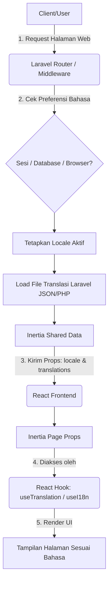

# Functional Specification Document (FSD)
## Fitur: Multi-Language (i18n)

### 1. Deskripsi Fitur
Fitur Multi-Language (i18n) memungkinkan aplikasi Web LMS (WLMS) untuk diakses dalam berbagai bahasa (misalnya, Bahasa Indonesia dan Bahasa Inggris). Fitur ini diimplementasikan menggunakan Laravel di sisi backend untuk mengelola file translasi, Inertia.js sebagai jembatan pengiriman data, dan React di sisi frontend untuk me-render teks yang diterjemahkan menggunakan kustom React Hook.

Tujuan utama fitur ini adalah meningkatkan aksesibilitas dan user experience (UX) bagi pengguna dengan preferensi bahasa yang berbeda.

### 2. Arsitektur & Alir Data (Flowchart)
Berikut adalah diagram alir yang menggambarkan proses bagaimana bahasa dimuat dari Backend ke Frontend:

### 3. Komponen Utama
- **Backend (Laravel)**: Menyediakan middleware untuk mendeteksi dan menyimpan locale pengguna, serta memanfaatkan mekanisme Share Data dari Inertia untuk mengirim array/objek translasi ke client.
- **Bridge (Inertia.js)**: Menyisipkan data `translations` dan `current_locale` ke dalam setiap response halaman.
- **Frontend (React)**: Menggunakan Hook kustom (misal `useTranslation()`) yang membaca teks berdasar *key* yang diminta dan mencocokkannya dari props Inertia secara reaktif.
