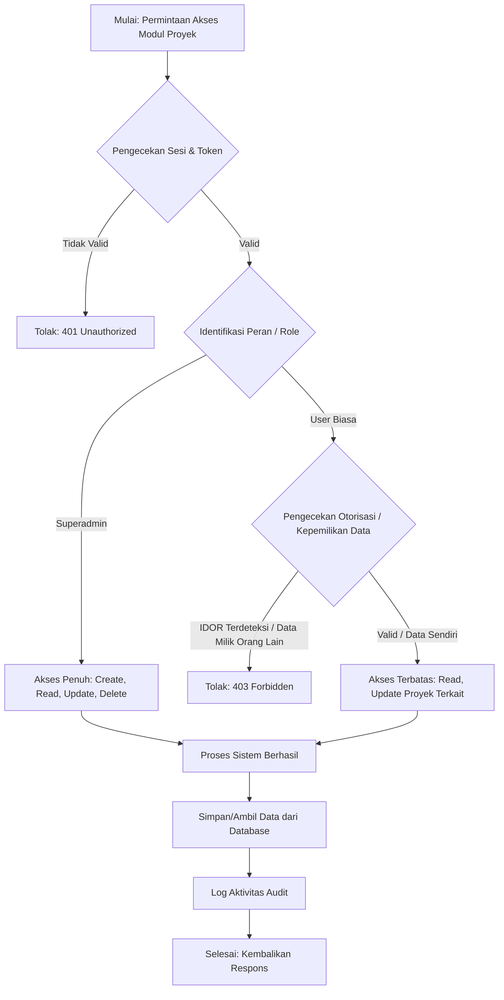

# FUNCTIONAL SPECIFICATION DOCUMENT (FSD)

**Modul:** Project Management (Manajemen Proyek)  
**Tanggal:** 17 September 2026  
**Status:** Approved (Lulus Audit QA & Security)  

## 1. Pendahuluan
Dokumen ini menguraikan spesifikasi fungsional untuk modul Manajemen Proyek (Project Management). Fitur ini mencakup proses pembuatan, pembacaan, pembaruan, dan pengarsipan/penghapusan (CRUD) data proyek di dalam sistem, serta pembatasan akses berbasis peran (Role-Based Access Control - RBAC).

## 2. Tujuan
Menyediakan panduan komprehensif bagi pengembang, penguji, dan auditor IT Compliance mengenai fungsionalitas dan otorisasi dari modul Manajemen Proyek.

## 3. Ruang Lingkup
Fitur Manajemen Proyek mencakup operasi berikut:
1. **Create Project**: Pengguna dengan hak akses yang sesuai dapat membuat proyek baru.
2. **Read Project**: Pengguna dapat melihat detail proyek yang diotorisasi untuk mereka.
3. **Update Project**: Pengguna dengan hak akses yang sesuai dapat memperbarui informasi proyek.
4. **Archive/Delete Project**: Pengguna dengan hak akses (Superadmin) dapat mengarsipkan atau menghapus proyek.

## 4. Otorisasi dan Keamanan (RBAC)
Akses menuju fungsi Manajemen Proyek diatur berdasarkan *Role-Based Access Control* (RBAC):
- **Superadmin**: Memiliki akses penuh terhadap seluruh operasi (Create, Read, Update, Delete/Archive) pada seluruh proyek.
- **User Biasa (Manager/Staff)**: Hanya dapat melihat dan memperbarui proyek yang ditugaskan kepada mereka. Tidak diperkenankan melakukan manipulasi data di luar otorisasi yang diberikan (Anti-IDOR terimplementasi).

## 5. Alur Sistem (Flowchart)
Berikut adalah alur pembuatan proyek dan pengecekan otorisasi RBAC:

## 6. Persyaratan Kepatuhan (Compliance)
Seluruh aktivitas dalam modul ini dicatat dalam log audit, meliputi ID pengguna, waktu akses, alamat IP, dan jenis operasi untuk mematuhi regulasi perbankan/BUMN terkait perlindungan data.
