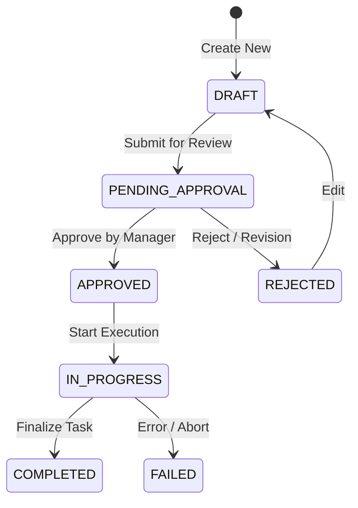

# FUNCTIONAL SPECIFICATION DOCUMENT (FSD)
## MODUL WORKFLOW & STATE MACHINE (STATUSES & WORKFLOWS)

**Informasi Dokumen**
| Atribut | Keterangan |
|---------|------------|
| **Nama Proyek** | WLMS (Warehouse Logistics Management System) |
| **Modul** | Workflow & State Machine |
| **Versi** | 1.0.0 |
| **Tanggal** | 17 September 2026 |
| **Status** | Final |
| **Penulis** | Technical Writer |

---

### 1. PENDAHULUAN
#### 1.1 Tujuan
Dokumen ini bertujuan untuk mendefinisikan spesifikasi fungsional dari Modul Workflow & State Machine pada sistem WLMS. Modul ini bertanggung jawab atas pengelolaan status (states) dan alur kerja (workflows) untuk berbagai entitas dalam sistem, memastikan integritas data dan keamanan operasional (Enterprise-Grade).

#### 1.2 Ruang Lingkup
Ruang lingkup mencakup:
- Manajemen Data Status (Pembuatan, Pembaruan, Penghapusan, dan Pembacaan Status).
- Manajemen Data Workflow (Pembuatan, Pembaruan, Penghapusan, dan Pembacaan Workflow yang menghubungkan status asal dan status tujuan).
- Integrasi aturan transisi antar status (State Machine) untuk entitas bisnis.

### 2. DESKRIPSI FUNGSIONAL
Sistem harus mampu memfasilitasi Superadmin dalam mengatur konfigurasi status yang dinamis, serta mendefinisikan transisi antar status secara rigid melalui workflow. Setiap perubahan status entitas bisnis dalam aplikasi akan divalidasi oleh State Machine, untuk mencegah loncatan proses yang tidak semestinya, manipulasi paramter (IDOR), dan inkonsistensi data.

### 3. ALUR PROSES (BUSINESS PROCESS)

#### 3.1 Diagram Alur Pengelolaan Status & Workflow
Berikut adalah diagram alur yang menggambarkan bagaimana sistem memvalidasi dan memproses transisi status sesuai desain security-first:

```mermaid
flowchart TD
    A[Start: Permintaan Perubahan Status Entitas] --> B{Validasi Autentikasi\n& Akses Sistem}
    B -- Ditolak --> C[Error 401/403: Akses Ditolak]
    B -- Lolos --> D{Cek Status Asal\ndan Status Tujuan}
    D --> E{Validasi State Machine\n(Apakah ada Workflow valid?)}
    E -- Tidak Valid --> F[Error 422: Transisi Tidak Diizinkan / Invalid State]
    E -- Valid --> G{Cek Role/Akses Transisi\n(Anti-IDOR / Privilege Check)}
    G -- Tidak Punya Akses --> H[Error 403: Role Tidak Diizinkan]
    G -- Punya Akses --> I[Terapkan Perubahan Status]
    I --> J[Catat ke Audit Trail / Log Transisi]
    J --> K[End: Transisi Berhasil]
    C --> K
    F --> K
    H --> K
```

#### 3.2 Diagram State Machine (Contoh Siklus Dokumen/Pesanan)


### 4. ATURAN BISNIS (BUSINESS RULES)
1. **Integritas Referensial (Anti-Soft-Delete Leak)**: Status yang telah direferensikan/digunakan oleh suatu entitas aktif tidak dapat dihapus (Restrict/Soft Delete mechanism).
2. **Validasi Transisi (State Machine Constraints)**: Pembaruan status (contoh dari `DRAFT` menjadi `COMPLETED`) tidak dapat dilakukan jika di dalam konfigurasi Workflow tidak terdapat rute yang menghubungkannya.
3. **Idempotensi**: Permintaan transisi yang sama berulang kali tidak boleh mengubah state secara inkonsisten (contoh: Mengirim status `APPROVED` ke dokumen yang sudah berstatus `APPROVED` akan diabaikan atau direject dengan pesan sesuai).
4. **Isolasi Data (Tenant-Isolation)**: Jika sistem beroperasi secara multi-tenant, Status dan Workflow milik Organisasi A tidak bisa dilihat apalagi diubah oleh Organisasi B.

### 5. MANAJEMEN HAK AKSES (ROLE & PERMISSION)
- **Superadmin**: Memiliki hak akses penuh (CRUD) terhadap konfigurasi dasar Status dan Workflow sistem.
- **Admin Instansi/Cabang**: Hanya dapat mengatur transisi spesifik yang berlaku pada organisasinya saja (terikat pada Tenant ID).
- **Staff/End-User**: Hanya memiliki hak eksekusi pergantian status sesuai dengan tugasnya, dan tidak memiliki akses modifikasi struktur state machine.

### 6. KRITERIA PENERIMAAN (ACCEPTANCE CRITERIA)
- Sistem dapat menyimpan dan menampilkan log dari setiap perpindahan status yang berhasil.
- Upaya melompati proses (bypass status) oleh user dengan modifikasi parameter API akan menghasilkan HTTP response `422` atau `403`.
- Upaya manipulasi ID yang bukan milik organisasinya (IDOR Attack) akan digagalkan dengan respons standar tanpa membocorkan eksistensi data (`404` atau `403`).
