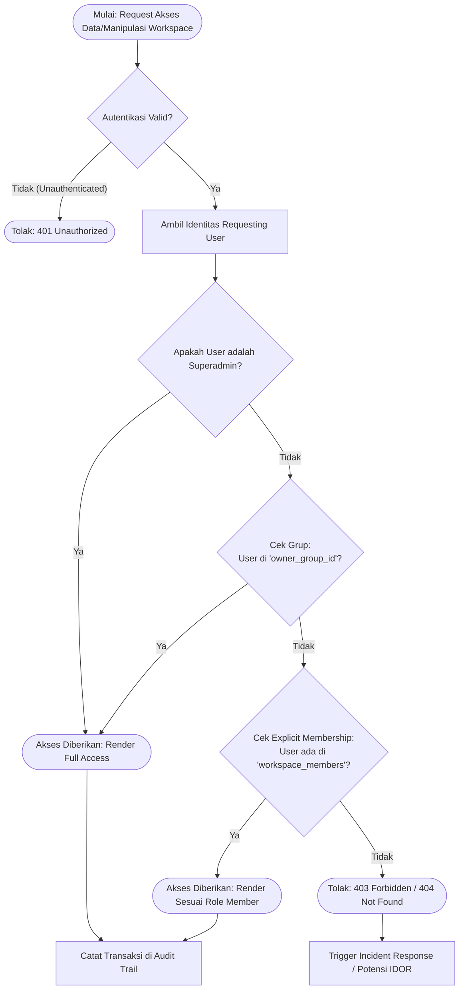

# FUNCTIONAL SPECIFICATION DOCUMENT (FSD) & ARCHITECTURE

**Modul:** Workspace Members & Security Visibility
**Fase:** 6 (Technical Writer)
**Tanggal:** 18 September 2026
**Status:** Approved (Lulus Audit QA & Security)

## 1. Pendahuluan
Dokumen ini menguraikan spesifikasi fungsional dan arsitektur keamanan untuk fitur **Workspace Members**. Fitur ini dirancang secara spesifik untuk mengatur struktur keanggotaan kolaboratif di dalam sebuah Workspace dan memastikan tercapainya isolasi data antar pengguna yang aman (multi-tenancy abstraction), melalui implementasi sistem keamanan **Anti-IDOR (Insecure Direct Object Reference)**.

## 2. Struktur Database
Relasi pengguna (User) dengan ruang kerja (Workspace) dikelola melalui *Pivot Table* (Many-to-Many relationship) dengan penambahan metadata penugasan.

### Skema Tabel `workspace_members`
Tabel ini merepresentasikan keanggotaan eksplisit pengguna ke sebuah Workspace.

- `id` (Big Integer / Primary Key)
- `workspace_id` (UUID, Foreign Key ke tabel `workspaces`, On Delete Cascade)
- `user_id` (Big Integer, Foreign Key ke tabel `users`, On Delete Cascade)
- `role` (String, Default: `viewer`) - *Mendefinisikan hak akses internal: `viewer`, `member`, `admin`.*
- `created_at` (Timestamp)
- `updated_at` (Timestamp)

Tabel ini mengimplementasikan `UNIQUE(workspace_id, user_id)` constraint pada tingkat database guna memastikan tidak terjadinya duplikasi keanggotaan dalam satu workspace.

## 3. Arsitektur Security (Anti-IDOR)
Guna mencegah kebocoran data (*Data Leakage*) secara vertikal maupun horizontal (IDOR vulnerability), sistem mengadopsi skema perizinan ganda (Dual-Ownership Validation) dalam merender data dan mengotorisasi tindakan di ruang kerja.

Kondisi otorisasi visibilitas (*Workspace Visibility*) dikendalikan sebagai berikut:

Sebuah Workspace berstatus **DAPAT DIAKSES** oleh entitas User Requesting bilamana:
1. **Kepemilikan Grup (Group Ownership Validation)**
   User terdaftar dalam Organisasi/Grup yang menjadi pemilik struktural Workspace tersebut (melalui parameter `owner_group_id` di entitas `workspaces`).
   **ATAU**
2. **Delegasi Eksplisit (Explicit Membership Validation)**
   User secara sah terdaftar sebagai anggota di tabel `workspace_members` dengan `workspace_id` yang terasosiasi.

Bilamana kedua syarat di atas tidak terpenuhi, sistem dirancang *fail-secure* dengan secara proaktif menolak akses menggunakan respon protokol `HTTP 403 Forbidden` atau `HTTP 404 Not Found` (untuk menyamarkan eksistensi data dari attacker).

## 4. API Endpoints
Berikut adalah spesifikasi integrasi *Endpoint API* Workspace Members (telah lolos tes integrasi Pest PHP):

- **GET `/api/workspaces/{workspace_id}/members`**
  - **Fungsi:** Mengembalikan daftar anggota yang berada di dalam Workspace.
  - **Pengamanan Akses:** Sistem memastikan user pemanggil (caller) memiliki visibilitas terhadap workspace tersebut.

- **POST `/api/workspaces/{workspace_id}/members`**
  - **Fungsi:** Menambahkan atau mengundang anggota baru ke Workspace (dengan role: `admin`, `member`, atau `viewer`).
  - **Pengamanan Akses:** Dibatasi (RBAC), mengharuskan user pemanggil memiliki autorisasi *Update Workspace* (Workspace Admin atau bagian dari Owner Group).

- **DELETE `/api/workspaces/{workspace_id}/members/{user_id}`**
  - **Fungsi:** Mencabut akses pengguna dari ruang kerja.
  - **Pengamanan Akses:** Mengharuskan autorisasi *Update Workspace*.

*Catatan QA: Segala percobaan Bypass-IDOR pada operasi manipulasi (POST/DELETE) antar anggota terisolasi dipastikan ditolak (Status 403).*

## 5. Hierarki Keamanan: Alir Visibilitas Workspace
Representasi diagram alir berikut menggambarkan tata kelola bagaimana Backend/Core merender dan mengevaluasi otorisasi visibilitas Workspace untuk Requesting User.

## 6. Integrasi Log Audit (Compliance)
Setiap modifikasi data (Penambahan, Pencabutan akses, Perubahan Role) maupun deteksi percobaan eksploitasi visibilitas Anti-IDOR wajib didokumentasikan di dalam **Global Audit Trail** guna memenuhi prasyarat investigasi *Security Forensics* serta mendukung parameter penilaian kepatuhan (*IT Governance/Compliance*).
