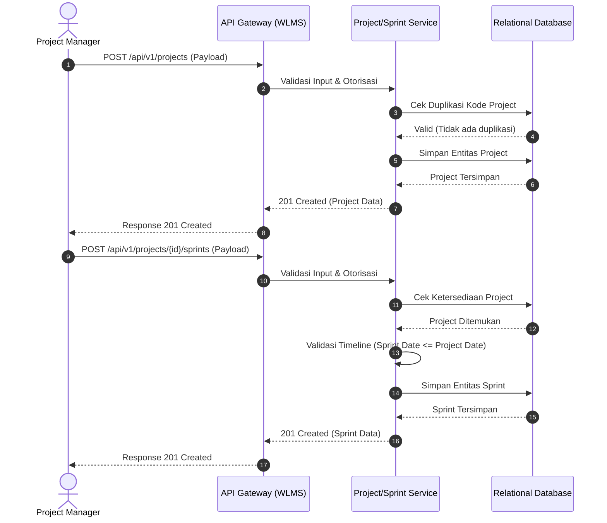

# Functional Specification Document (FSD)
## Modul Manajemen Proyek dan Sprint (Phase 6)

**Versi Dokumen:** 1.0.0
**Status:** Final / APPROVED
**Klasifikasi:** Internal Terbatas

### 1. Latar Belakang dan Tujuan Bisnis
Workload Management System (WLMS) memerlukan modul fundamental untuk mengelola siklus hidup inisiatif bisnis melalui entitas **Project** dan iterasi kerja melalui entitas **Sprint**. Modul ini memfasilitasi _Project Manager_ dan _Scrum Master_ dalam merencanakan alokasi sumber daya dan menargetkan batas waktu (timeline) secara presisi.

### 2. Ruang Lingkup (Scope)
Spesifikasi ini mencakup fungsionalitas:
1. Registrasi dan pengaturan _Project_ baru.
2. Pembuatan dan penjadwalan _Sprint_ di dalam batasan waktu _Project_.
3. Validasi aturan bisnis terkait status dan linimasa waktu.

### 3. Alur Proses Bisnis (Business Process Flow)
Berikut adalah alur sistem pada saat penciptaan Project dan Sprint.

### 4. Spesifikasi Entitas dan Validasi
#### 4.1 Entitas Project
| Atribut | Tipe Data | Mandatory | Aturan Validasi / Keterangan |
| :--- | :--- | :---: | :--- |
| `ProjectCode` | String | Y | Maks 10 karakter, Alfanumerik kapital, Unik. |
| `ProjectName` | String | Y | Maks 100 karakter. |
| `StartDate` | Date | Y | Tidak boleh kurang dari tanggal server (hari ini). |
| `EndDate` | Date | Y | Harus lebih besar atau sama dengan `StartDate`. |
| `Status` | Enum | Y | _Default_: `PLANNED`. Limitasi state: `PLANNED`, `ACTIVE`, `COMPLETED`, `ON_HOLD`. |

#### 4.2 Entitas Sprint
| Atribut | Tipe Data | Mandatory | Aturan Validasi / Keterangan |
| :--- | :--- | :---: | :--- |
| `ProjectId` | UUID | Y | Harus merujuk pada Project yang eksis dan tidak berstatus `COMPLETED`. |
| `SprintName` | String | Y | Maks 50 karakter (Contoh: "Sprint 1 - Onboarding"). |
| `StartDate` | Date | Y | Harus berada dalam rentang waktu `StartDate` dan `EndDate` Project terkait. |
| `EndDate` | Date | Y | Harus lebih besar dari `StartDate` Sprint, dan tetap dalam rentang Project. |
| `Status` | Enum | Y | _Default_: `DRAFT`. Limitasi state: `DRAFT`, `ACTIVE`, `CLOSED`. |

### 5. Aturan Bisnis (Business Rules)
1. **Time-boxing Constraint:** Sistem harus menolak pembuatan _Sprint_ apabila `StartDate` atau `EndDate` berada di luar linimasa _Project_ induk. Fungsionalitas ini mencegah kebocoran anggaran dan waktu.
2. **State Dependency:** _Sprint_ tidak dapat diubah menjadi `ACTIVE` jika _Project_ masih dalam state `PLANNED` atau `ON_HOLD`.
3. **Immutability Limits:** `ProjectCode` bersifat _immutable_ setelah sistem merespons sukses (201 Created).

