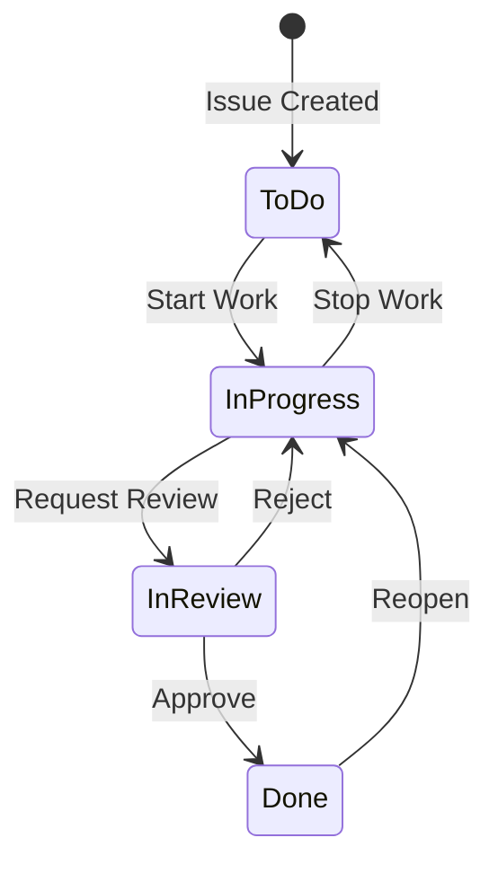

# Functional Specification Document (FSD)
## Module: Issues/Tasks Management (Sprint 7)

### 1. Pendahuluan
Dokumen ini menguraikan spesifikasi fungsional dan teknis untuk modul manajemen isu dan tugas (Sprint 7) pada Workload Management System (WLMS). Modul ini menggunakan Clean Architecture pada backend dan pendekatan Optimistic UI pada antarmuka pengguna.

### 2. Arsitektur Backend
Sistem menggunakan pendekatan Modular Monolith.
- **Entity**: `Issue` (Aggregate Root) bertanggung jawab atas konsistensi data tugas.
- **Value Objects (VO)**: 
  - `IssueKey` (Auto-numbering project, misal: PROJ-123).
  - `IssueStatus` (Status dari isu).
- **Domain Services**:
  - `WorkflowEngine`: State Machine yang memvalidasi transisi status isu. Mesin ini memastikan bahwa sebuah isu hanya bisa berpindah dari status A ke B apabila didefinisikan dalam aturan _Workflow_.

#### State Machine Workflow Diagram

### 3. Arsitektur Antarmuka Pengguna (UI)
Antarmuka manajemen tugas dibangun sebagai Kanban Board menggunakan pustaka `dnd-kit`.
- **Drag-and-Drop**: Pengguna dapat memindahkan tiket antar kolom status.
- **Optimistic UI / Rollback**: Saat pengguna menjatuhkan (drop) kartu pada kolom baru, UI akan langsung diperbarui seolah-olah berhasil. Apabila API mengembalikan error (contoh: validasi `WorkflowEngine` gagal), UI akan secara otomatis melakukan _rollback_ mengembalikan kartu ke kolom asalnya tanpa _page reload_.

